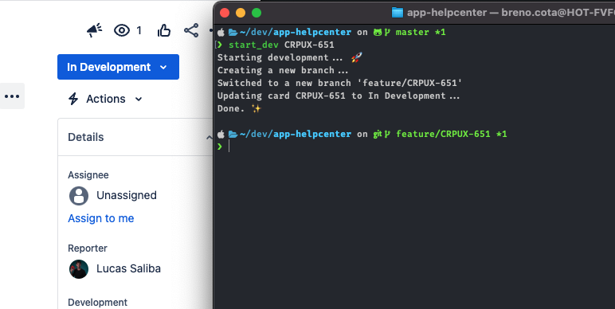
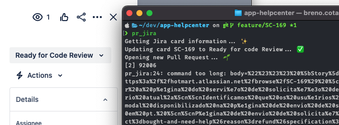

## 🚀 X Power Dev (or something better)

This script automates the process of Development and creating a GitHub pull request based on a Jira ticket. It fetches information about the Jira ticket, such as summary and description, and uses it to create a pull request on a GitHub repository. This automation helps streamline the workflow for developers who use Jira for issue tracking and GitHub for version control and collaboration.

### Features ⚡️🤖
- **Efficient Workflow:** With a simple command, developers can create a feature branch, commit changes, push the branch to GitHub, and open a pull request, all in one go.
- **Automatic PR Title:** The script extracts the Jira ticket summary and uses it as the title of the GitHub pull request, ensuring consistency and clarity in communication.
- **Customizable Branch Naming:** The script generates a feature branch name based on the Jira ticket key, making it easy to identify the associated work.
- **Detailed PR Description:** The pull request description includes the Jira ticket key and description, providing context to reviewers about the changes being proposed.

### Start your development more easily 

- Create a new branch
- Update card status to in development



### Open new Pull Request
- Create new Pull Request with Jira information (title, summary, link) 
- Update card status to Ready for Code Review




### How to Use
- Make sure you have [jq](https://jqlang.github.io/jq/) installed on your system.
- Replace the placeholders token in the script with your actual personal access token ([get here](https://id.atlassian.com/manage-profile/security/api-tokens)).
- Run the script from the command line with the Jira ticket key as an argument to start dev.
- copy content to ```~/.zshrc```


<hr />

⚠️ For some Jira cards, the transaction_id may vary according to the new Jira workflow configuration

